.. _get_started_managed_kf:

Get started with Managed Kubeflow on Azure
==========================================

This guide describes how to get started with Canonical's fully `managed solution <https://ubuntu.com/managed-infrastructure>`_ 
of Charmed Kubeflow (CKF) running on top of `Microsoft Azure <https://azure.microsoft.com/en-us>`_. 
It provides supported operation management, deployment, and dedicated customer service.

.. note::

   Watch `this video <https://drive.google.com/file/d/1mHXIrXXSN-XkLJTvMN3991MerRvCFXM0/view?usp=sharing>`_ to find the correct Kubeflow listing in the Azure Marketplace and to see a walkthrough of the installation process.

---------------------
Requirements
---------------------

Before starting, ensure you have:

* Admin rights on your Azure tenant.
  
  * You might need to create and register an EntraID application. If you are not the sole admin of this account, or if it's owned by an organization, you might encounter permission issues.

* The ``Microsoft.Compute`` and ``Microsoft.Capacity`` resource providers registered.

  * In case they are not, please proceed to register them following `this Microsoft guide <https://discourse.charmhub.io/t/enable-microsoft-providers/16129>`_. Then, wait for a few hours. Azure takes up to 24h to reconcile this change. If you try to deploy right after enabling the providers, you might encounter quota verification issues.

.. note::

   If you encounter quota limits for your preferred VM size, you will be prompted to request a quota increase. 
   Azure generally grants the request fairly quickly, but you need to **restart** the Kubeflow deployment wizard afterwards; otherwise, your new quota limits might not be recognized.

-------------------------
Access Azure Marketplace
-------------------------

Visit `Azure Marketplace <https://portal.azure.com/#create/canonical-test.managed-kubeflow-previewkubeflow-metered>`_ to find Canonical's Managed Kubeflow offering.

You will find all the information about the application, available plans and pricing, reviews, and more.

1. Get started by clicking ``Create``.

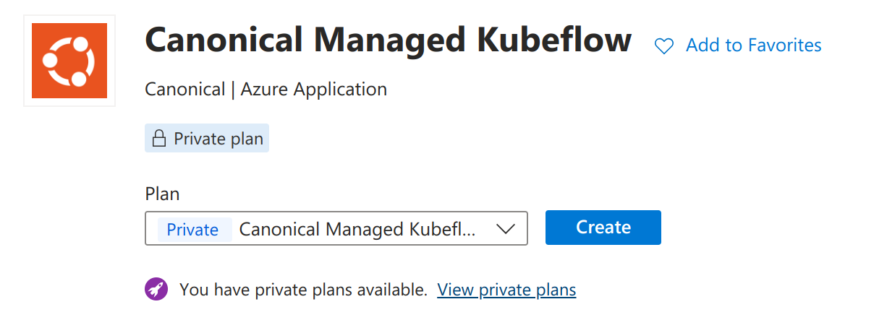

-----------------------------
Configure Kubeflow parameters
-----------------------------

Configure some Kubeflow parameters based on your needs by following these steps:

1. Start by selecting a subscription and a resource group name (create a new one if needed). This is where Kubeflow is set up:

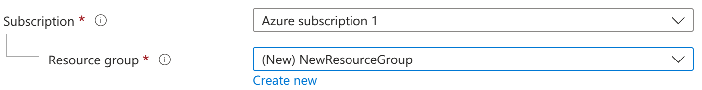

2. In the Instance details section, select the region:

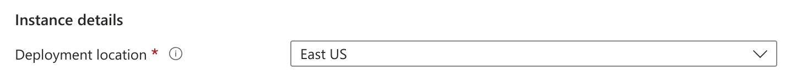

3. Insert your contact information:

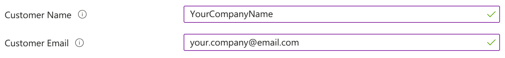

4. Insert the application name and its managed resource group that will contain the managed service. You can leave the latter field as is by default:

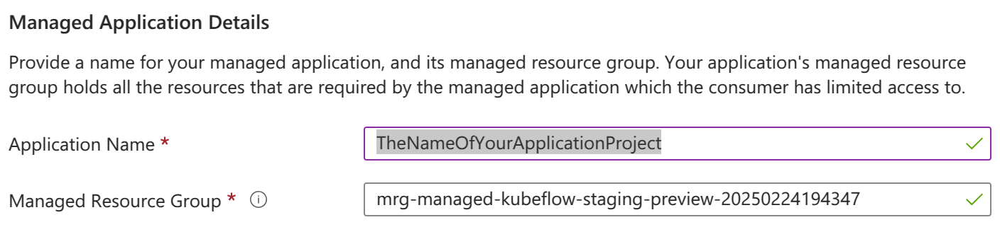

5. Once completed, click ``Next``.

-----------------------
Configure your Kubeflow
-----------------------

You can now configure your Kubeflow instance.

.. note::

   In case you see this warning box:

   .. image:: ./get-started-images/06-warning.png
      :align: center

   You need to enable those Microsoft resource providers for the setup to be able to check your vCPUs/vGPUs quotas. Refer to the guide provided in the warning box for more details.

1. Choose if you want to enable or disable High Availability (HA):

   .. image:: ./get-started-images/07-high-availability.png
      :align: center

   HA provides the reliability needed for production and high-workload environments. Disabling it will allow you to save on costs, but the environment will be less reliable as the management services will run without redundancy.

.. note::

   Enabling HA is recommended for production environments, while disabling it for development and testing environments is acceptable.

2. Choose the management instance size you prefer. The size shown below is just for reference:

The use of GPUs for the management instances is not recommended. In most cases, the suggested size is enough.

.. warning::
    The system automatically checks if the required quota for the setup is allowed in your Azure tenant. If it's not, the procedure generates a message containing all the information needed to increase your quota before continuing with the setup. Please, follow those instructions.

Configure now the worker pools.
Worker pools are a way to have different workloads on different types of CPUs and GPUs, so that the least important tasks may run on the cheapest GPUs, 
while highly important tasks are performed on the fastest ones.

You can independently allocate the worker pools for different purposes. 
For example, you might allocate a worker pool of vCPUs for trivial development tasks or to work on a PoC, 
while a worker pool of powerful vGPUs works on training machine learning models.

.. note::

   After the deployment is complete, you can add and remove worker pools by contacting Canonical's support.

This deployment allows up to four worker pools with different CPU or GPU sizes for different workloads, and each worker pool automatically scales between the minimum and maximum values you choose.

3. Use the slider to select up to four pools.

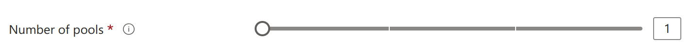

4. For each pool, you can configure its name, the worker size, and the workers range Kubeflow will use. The size shown below is just for reference:

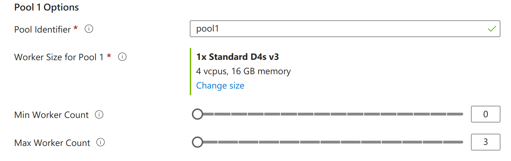

Depending on your setup purpose, choose between vCPUs or vGPUs. vGPUs are recommended for production environments.

.. warning::
    The system automatically checks if the required quota for the setup is allowed in your Azure tenant. If it's not, the procedure generates a message containing all the information needed to increase your quota before continuing with the setup. Please, follow those instructions.

5. Once all pools are configured and the quotas are all set, click Next.

---------------------
Configure access
---------------------

To configure access, you can choose between filling the values with your own OpenID parameters or creating new access credentials based on Azure Entra ID:

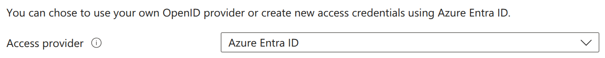

If you choose Azure Entra ID, follow the steps below to generate the following required values:

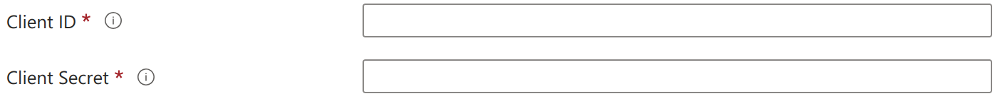

1. To register a new App, copy the ``OpenID Redirect URL`` from the page you are in:

2. Open the link in the information box:

3. Choose the Entra ID application name. It can be different from the application name you chose earlier for the deployment:

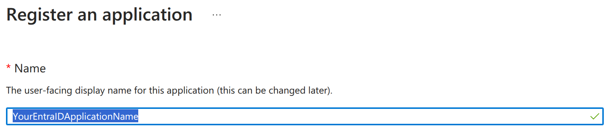

4. Choose ``Web`` in the ``Redirect URI`` combo box and paste the ``OpenID Redirect URL`` in the text box:

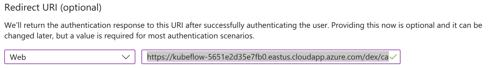

5. Click ``Register`` to complete the registration, leaving the other parameters as they are.

6. Refer to `App Registrations <https://portal.azure.com/#view/Microsoft_AAD_IAM/ActiveDirectoryMenuBlade/~/RegisteredApps>`_ and, on that page, click on the app you just created. You can find it by the name.

7. Now copy and paste the ``Application (client) ID`` into the ``Client ID`` field back in the deployment tab:

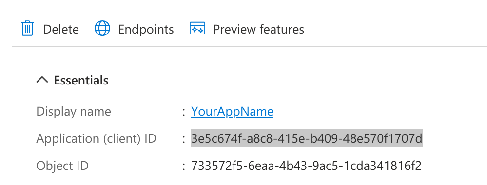

8. Collect the ``Client Secret`` by clicking on ``Manage`` on the left-side navigation bar, and then on ``Certificates & secrets``, then click ``+ New client secret``.

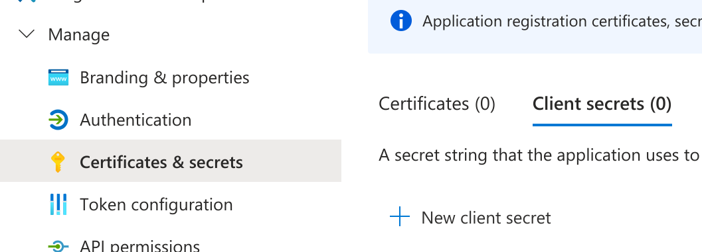

9. Add a description and click ``Add`` to create the secret. Optionally you can choose one year as the expiring time:

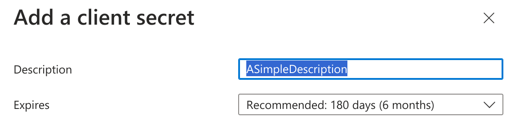

10. Copy and paste the secret's ``Value`` into the ``Client Secret`` field back in the deployment tab:

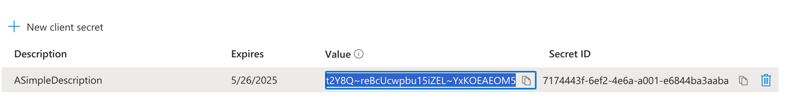

11. Now all fields are compiled, the Entra ID configuration page should look like this:

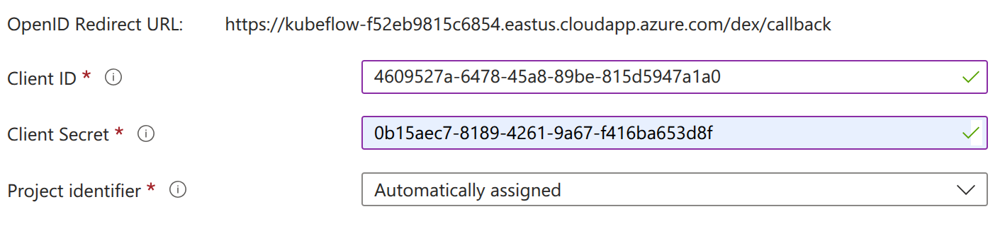

12. Click ``Next`` to go to the review page.

---------------------
Review and submit
---------------------

1. Check and agree with the terms and conditions.
2. Click ``Create`` to finish the configuration and start the setup.

.. note::

   The setup should take between 15 and 60 minutes. 
   Once completed, you will be notified via email from `canonical.com <mailto:noreply+portal+managed@canonical.com>`_ which will give you all the links and information to start using your setup. If you cannot find it, please check your Spam folder.

---------------------
Get further help
---------------------

You can `contact Canonical Managed Services <https://ubuntu.com/managed-infrastructured>`_ for customized deployments if you are a new user.

You can also visit the `Support portal <https://portal.support.canonical.com/>`_ or `contact our Support team if you are an existing user <https://canonical.com/contact-us>`_. You will be asked to provide your Ubuntu One account details, your subscription date, and the email address associated with the deployment.
