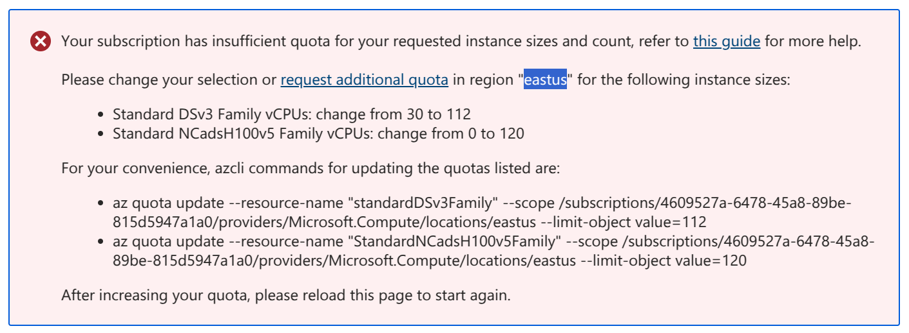
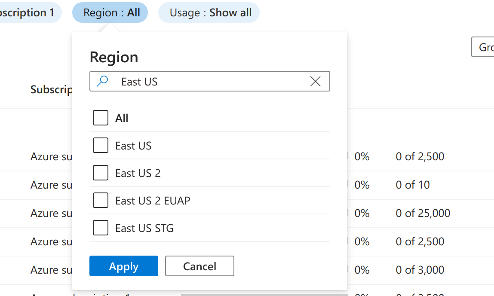
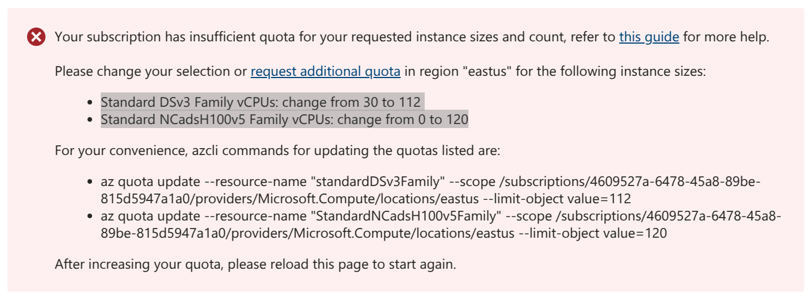
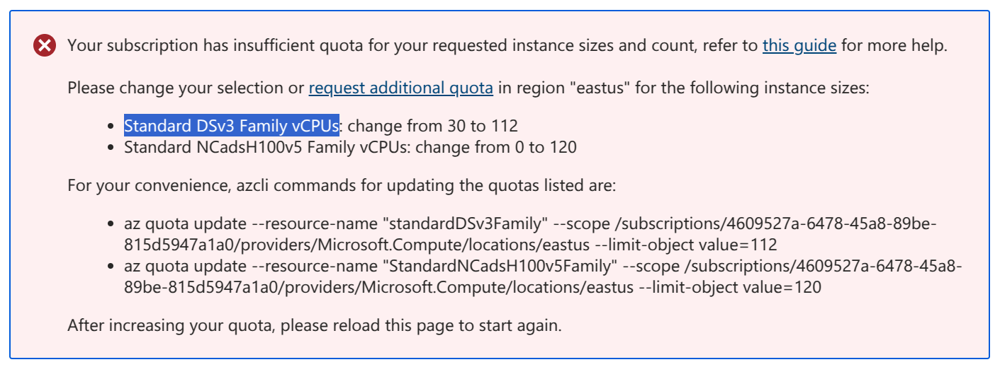
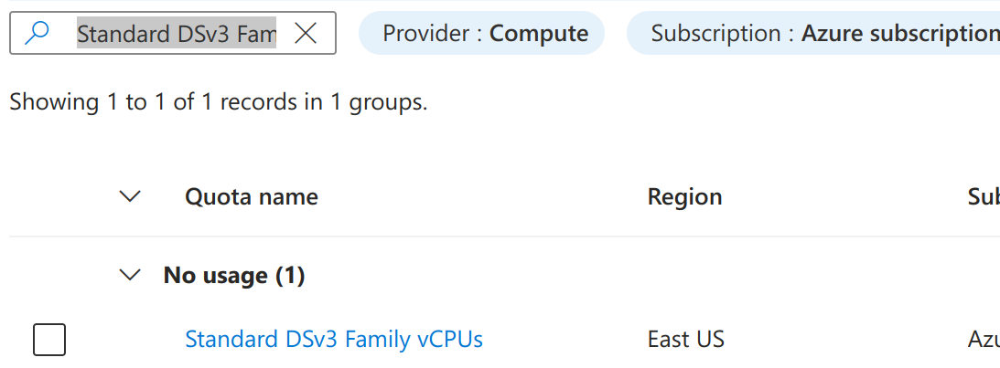
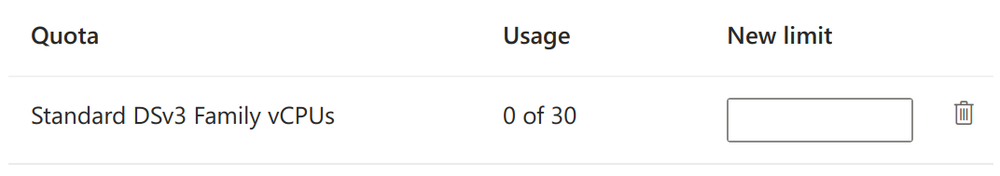
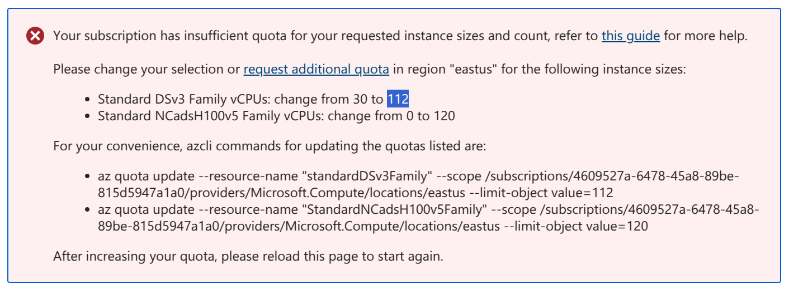

Configure Quotas
================

This guide describes how to configure Azure quotas to set up a Canonical Managed application.

.. note::

   All information needed to change the quota is in the error message.

1. Get started by visiting the `quota page <https://portal.azure.com/#view/Microsoft_Azure_Capacity/QuotaMenuBlade/~/myQuotas>`_.

2. Find the region where you need additional quota:

3. Use ``Region`` to filter the information in the quota page as shown below:

Now that only the CPU families available in that region are shown, request the
additional quota for all the CPU/GPU families listed in the error message:

4. From the error message, copy the CPU/GPU family:

5. Paste the family in the search box of the quota page:

6. Click on the pen icon at the far end of the line, a new screen will appear:

7. Set ``New limit`` to the suggested value.

8. Click ``Submit`` for the quota to be granted.

9. Do this for all listed CPU/GPU families within the error message.

You can continue with your setup after all CPU/GPU families have the required quota.

.. note::

   Quota request processing time depends on Microsoft and may vary. Approval could
   take anywhere from a few minutes to several days, or your request might be rejected.
   If Azure doesn't grant your requested quotas, see
   `how to request an increase for non-adjustable quotas <https://learn.microsoft.com/en-us/azure/quotas/per-vm-quota-requests#request-an-increase-for-non-adjustable-quotas>`_.

