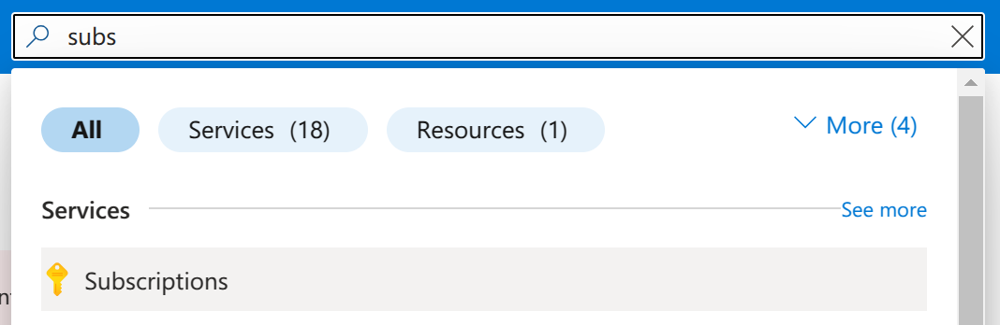
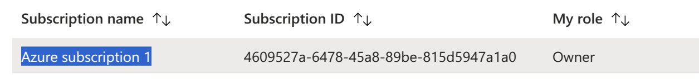
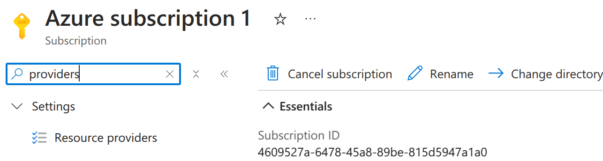
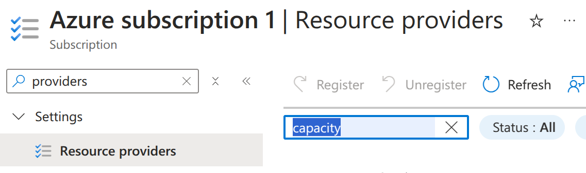
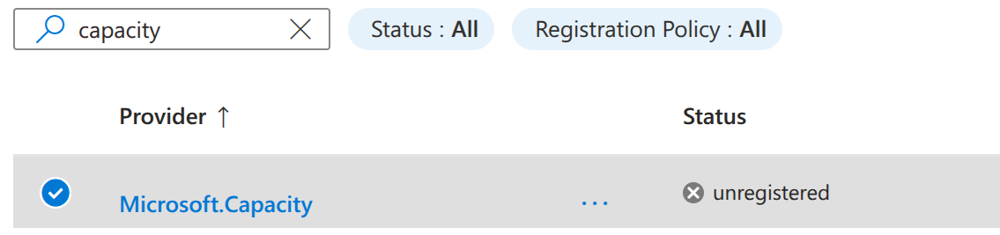
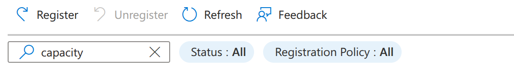
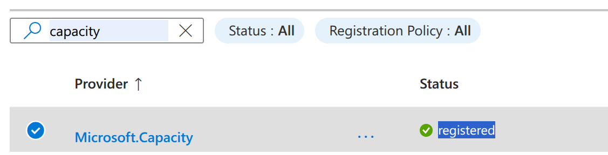
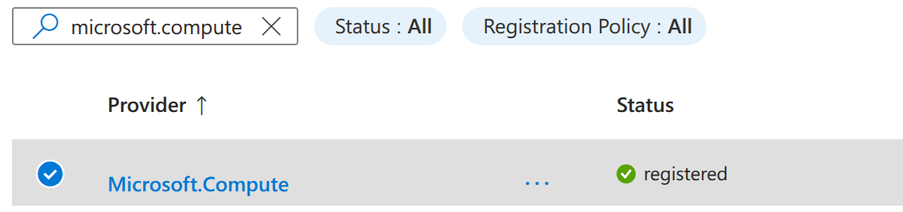

Enable Microsoft providers
============================

This guide describes how to register your `Microsoft.Capacity`, `Microsoft.Storage`, and `Microsoft.Compute` providers required to set up a Canonical Managed application.

.. note::

   If you are already on the `Resource Providers` page, skip to step 4.

1. Go to the Azure `Subscriptions` page by searching on the top bar:

2. Click on the subscription you want to use for the setup:

3. Search for `providers` on the menu search box and click on `Resource Providers`:

4. Search for `capacity` using the `Filter by name` field:

5. You should see that `Microsoft.Capacity` status is `notRegistered` or `unregistered`:

6. Select it by checking the circle before the name and click `Register` on the top:

7. Wait until the provider status changes to `Registered`:

8. Now do the same for `Microsoft.Compute`.

9. Search for it using the `Filter by name`.

10.  Select it by checking the circle before the name, and click the `Register` button.

11.  Wait until the provider changes to `Registered`:

12. Now do the same for `Microsoft.Storage`.

13. Search for it using the `Filter by name`.

14.  Select it by checking the circle before the name, and click the `Register` button.

15.  Wait until the provider changes to `Registered`:

16. Once all providers are registered, you need to restart your setup. The easiest way is to close the setup tab in your browser and restart it from the `Azure Marketplace <https://portal.azure.com/#create/canonical.managed-kubeflowkubeflow-metered>`_.