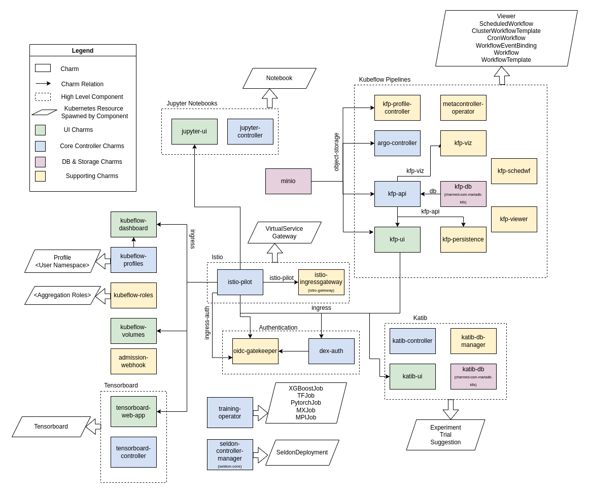
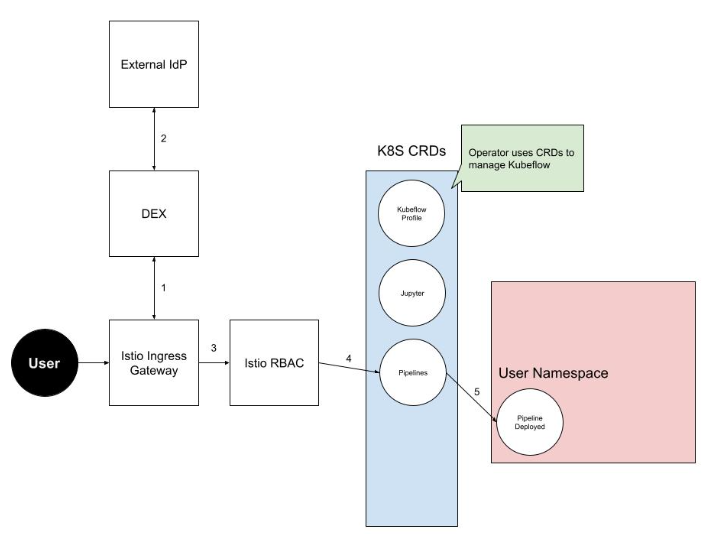

Components involved in a Managed Kubeflow deployment 
=====================================================

Subscription
-------------

Ubuntu Pro
~~~~~~~~~~

Ubuntu Pro is a comprehensive subscription for open-source software security and management running on Ubuntu LTS. It provides a suite of services, including advanced tooling and optional phone and ticket support, to give you confidence in the security of your Ubuntu infrastructure.

Every organization faces its own unique set of challenges. Ubuntu Pro empowers you by providing a single point of access to a range of specialist Canonical technologies that you can choose from to suit your needs. You can patch, monitor and harden your Ubuntu estate while having access to expert support.

`https://ubuntu.com/pro <https://ubuntu.com/pro>`_

LTS OCI Images
^^^^^^^^^^^^^^

Hardened container images, with stable tracks from development to production. Up to ten years guaranteed security maintenance from Canonical’s trusted repositories.

`https://ubuntu.com/containers <https://ubuntu.com/containers>`_

Automation Tools
-----------------

Juju
~~~~

`Juju <https://documentation.ubuntu.com/juju/3.6/>`_ is a service modeling software implemented as a distributed system. It uses a model description as an input and delivers an environment according to a set of requirements defined in the model. It is also used to manage the lifecycle of services in a given model.

Juju consists of a number of components:

#. Controller node (physical or virtual) which hosts API and database components of Juju

   - Controllers include a machine provider-specific provisioning logic (MAAS acts as a machine provider in this case)
#. Juju client which is used to bootstrap and manage Juju itself and models provisioned via Juju
#. Machine agents are used to perform post-deployment machine-related tasks that are relevant for Juju operation and report to Juju controller nodes
#. Unit agents execute application lifecycle events. The concrete application-specific logic is encoded in Charms.

Juju Operators or Charms
^^^^^^^^^^^^^^^^^^^^^^^^
Operators encode the operational knowledge about a particular application in a reusable way. The operational knowledge in question is about deployment, scaling, upgrades, post-deployment reconfiguration, setting up the software in a highly available configuration, integrations with other applications, etc.

An application provider would typically have the best operational knowledge about a given application and Operators provide a way to express this knowledge in a more sophisticated way than what deployment-focused automation and regular configuration tooling can do.

Operators rely on Juju to provide them with a platform for distributed and event-driven code execution, data exchange, and a data model for common operations. However, the specifics of how to use that platform for a particular application are outside of Juju and are implemented in concrete charms.

The generic approach to operations taken in Juju and Operators makes Operators an exceptional tool not only in deploying and operating simple applications like load balancers or web servers but also in complex applications such as OpenStack or Kubernetes.

Most of the software deployment in this engagement will be done using Juju and Charms. All charms that will be used in this project are open-source and available at `https://charmhub.io/ <https://charmhub.io/>`_.

Machine Learning Operations
----------------------------

Charmed Kubeflow
~~~~~~~~~~~~~~~~

Charmed Kubeflow is a collection of open-source applications deployed using Canonical’s lifecycle management tool - Juju. Juju provides the platform for which Operators run and manage the everyday tasks of applications. The combination of Operators and an Application makes them charmed as is in the case with Charmed Kubeflow. 

The main components of the Charmed Kubeflow are:

* Kubeflow Pipelines with Argo Workflows - workflow orchestration, management and scheduling
* Jupyter notebooks - web ui-based experimentation environment
* Katib - hyperparameter tuning and network architecture search
* MLflow - experiment tracking and model registry
* Seldon Core - model serving and inference engine
* KServe - model serving and inference engine
* Prometheus and Grafana - monitoring
* Radosgw integration - providing object storage
* Dex - authentication integration

`https://canonical.com/mlops/kubeflow <https://canonical.com/mlops/kubeflow>`_ and `https://documentation.ubuntu.com/charmed-kubeflow/ <https://documentation.ubuntu.com/charmed-kubeflow/>`_

Jupyter
^^^^^^^
Jupyter is an interactive notebook project born out of IPython. Interactive notebooks are used to run and test experiments within Kubeflow. They are often used as the go-to Python and R for Data Scientists.

Jupyter can be used to write and test preprocessing models before deploying them to consume the data. Jupyter notebooks will be able to consume whole GPUs or MIG slices.

`https://github.com/canonical/notebook-operators <https://github.com/canonical/notebook-operators>`_

PyTorch/TensorFlow
^^^^^^^^^^^^^^^^^^^
Pytorch/Tensorflow are tensor libraries for deep learning GPUs and CPUs, it provides native integration with libraries such as CUDA as well as other features which utilize the hardware on which the ML application is running. Preconfigured environments with these libraries can be created using `NGC containers <https://catalog.ngc.nvidia.com/>`_.

`https://pytorch.org/ <https://pytorch.org/>`_

`https://www.tensorflow.org/ <https://www.tensorflow.org/>`_

Argo Workflows
^^^^^^^^^^^^^^
Argo Workflows is an open-source container-native workflow engine for orchestrating parallel jobs on Kubernetes. Argo Workflows is implemented as CRDs on the Kubernetes platform and is used as the workflow orchestrator for the Kubeflow Pipelines.

Argo workflow steps are spawned as Pods in the Kubernetes cluster. Tasks can be executed using CPU, whole GPUs, or MIG slices.

Dex
^^^
Dex is an IDP solution that can integrate with Kubernetes providing integrated OIDC support or support for other authentication methods such as LDAP. Dex provides login information for Charmed Kubeflow using static usernames and passwords by default but can be configured to use other authentication providers.

Currently supported integration for multi-user Kubeflow are LDAP and OIDC.

Charmed MLflow
~~~~~~~~~~~~~~~

MLflow is an open-source platform to manage the ML lifecycle from experimentation to production day-two operations. It contains four key components:

* Tracking - record experiments and compare results
* Projects - packaging ML code for sharing or deployment on production
* Models - managing and deploying models on a variety of serving and inference platforms
* Registry - central model store to keep versioned models

MLflow is integrated with the Kubeflow Dashboard to allow a single view of model experiment results.

`https://discourse.charmhub.io/t/get-started-with-charmed-mlflow-v2-and-charmed-kubeflow/10782 <https://discourse.charmhub.io/t/get-started-with-charmed-mlflow-v2-and-charmed-kubeflow/10782>`_

`https://documentation.ubuntu.com/charmed-kubeflow/ <https://documentation.ubuntu.com/charmed-kubeflow/>`_

Istio
~~~~~~

Kubeflow is composed of tens of components that communicate with each other. Istio is used in Kubeflow to apply rules to that communication. Istio enforces user authentication when accessing Kubeflow services:

Kubeflow is using DEX for federated access. LDAP and OIDC are supported back-ends.

`https://istio.io/ <https://istio.io/>`_

`https://charmhub.io/istio <https://charmhub.io/istio>`_

Triton 
~~~~~~

Triton enables teams to deploy any AI model from multiple deep learning and machine learning frameworks, including TensorRT, TensorFlow, PyTorch, ONNX, OpenVINO, Python, RAPIDS FIL, and more. Triton supports inference across cloud, data center, edge and embedded devices on NVIDIA GPUs, x86 and ARM CPU, or AWS Inferentia. Triton delivers optimized performance for many query types, including real time, batched, ensembles and audio/video streaming.

`https://developer.nvidia.com/dynamo-triton <https://developer.nvidia.com/dynamo-triton>`_

Canonical Observability Stack
------------------------------

Highly integrated, low-operations observability stack powered by Juju and Microk8s.

The Canonical Observability Stack (COS Lite) gathers, processes, visualizes, and alerts on telemetry signals generated by workloads running both within, and outside of, Juju.

By leveraging the topology model of Juju to contextualize the data, and charm relations to automate configuration and integration, it provides a low-ops observability suite based on best-in-class, open-source observability tools.

For Site-Reliability Engineers, Canonical Observability Stack provides a turn-key, out-of-the-box solution for improved day 2 operational insight.

`https://charmhub.io/topics/canonical-observability-stack <https://charmhub.io/topics/canonical-observability-stack>`_

Servers
~~~~~~~
Grafana (Monitoring and Alerts)
^^^^^^^^^^^^^^^^^^^^^^^^^^^^^^^
Grafana allows querying, visualizing, alerting, and understanding the metrics no matter where they are stored. It makes it possible to create, explore, and share dashboards with the operations team and foster a data-driven culture.

Canonical observability tool allows both customers and operators to zoom in on the details of any of the higher-level graphs to obtain further information.

The portal also includes an efficient time series database allowing for tracking the evolution of the cloud metrics and health status over time.

`https://charmhub.io/grafana-k8s <https://charmhub.io/grafana-k8s>`_

Prometheus (Metrics database)
^^^^^^^^^^^^^^^^^^^^^^^^^^^^^
Prometheus was originally developed as a scalable multi-dimensional data model with a powerful query language. It is a service for monitoring other systems by collecting metrics from configured targets at regular intervals.

`https://charmhub.io/prometheus-k8s <https://charmhub.io/prometheus-k8s>`_

Loki (Logs database)
^^^^^^^^^^^^^^^^^^^^^
Loki is a horizontally scalable, highly available, multi-tenant log aggregation system inspired by Prometheus. It is designed to be very cost effective and easy to operate. It does not index the contents of the logs, but rather a set of labels for each log stream.

`https://grafana.com/oss/loki/ <https://grafana.com/oss/loki/>`_

`https://charmhub.io/loki-k8s <https://charmhub.io/loki-k8s>`_

Agents
~~~~~~

Integrations to COS are mostly done through Juju Relations with Charmed Applications like Charmed Kubeflow, when there is no existing integration with a Charmed Application or to monitor resources on non-charmed applications the Grafana Agent can be used.

Grafana Agent
^^^^^^^^^^^^^
Grafana Agent is a vendor-neutral, batteries-included telemetry collector with configuration inspired by Terraform. It is designed to be flexible, performant, and compatible with multiple ecosystems such as Prometheus and OpenTelemetry.

`https://grafana.com/docs/agent/latest/ <https://grafana.com/docs/agent/latest/>`_

`https://charmhub.io/grafana-agent <https://charmhub.io/grafana-agent>`_

